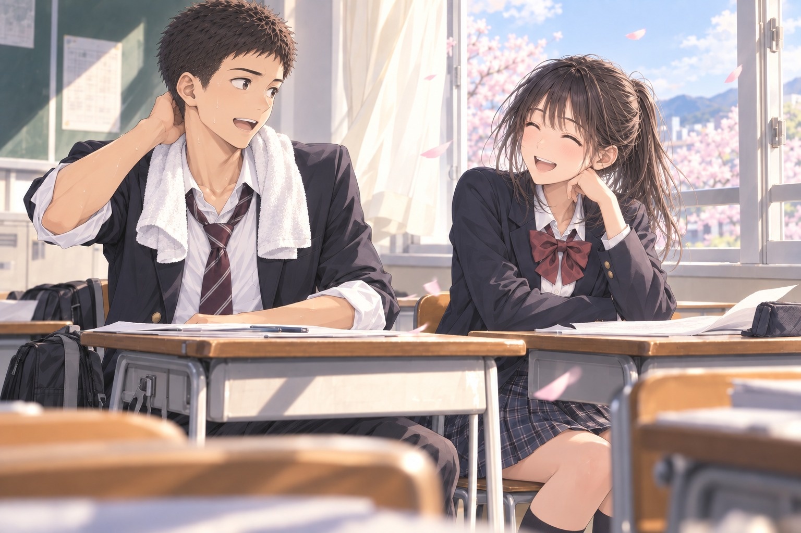

# ［P01-02］窓際のスーパールーキー

教室の後ろの扉を開けると、いくつかの顔がこちらへ向いた。

勇は首に掛けたタオルで汗を拭きながら、朝、鞄を置いた席へ向かう。

その隣には、朝はいなかった女子が座っていた。机の上で書類をそろえていた彼女が、近づいてくる勇の顔を見上げる。

「あ！　やっぱり、バスケ出てた人！」

聞き覚えがあった名前。
体育館で見た顔を思い出して確信したようだった。

勇は椅子を引きながら、軽く頭を下げた。

「どうも。スーパールーキーです」

「あはは、自分で言うんだ」

「かわいげあるでしょ？」

「そういうことにしといてあげる」

彼女は目を細めて、楽しそうに笑った。

「神谷勇。よろしく」

「河合由美子です。よろしく」

勇が席へ着くと、由美子は待ってましたとばかりに体をこちらへ向けた。

「最後のスリーポイント、すごかったね！　二人も寄ってきてたのに、そのまま迷わず打つからびっくりした」

「ああ、あれね。今日はたまたまよく入っただけ」

勇は首の後ろをタオルで拭いた。褒められて少し照れくさそうに笑っている。

「いつもあんな遠くから打つの？」

「練習ではね。試合だとあそこまでフリーになること滅多にないし。今日は先輩のパスが完璧だったから」

「でも、最後は全然フリーじゃなかったよ？」

「うん。……あれは、外してたらどやされてたかな」

由美子がくすっと笑うと、勇もつられて笑った。

すると由美子は、最後のシュートをまねるように、手首をちょこんと曲げて片手を掲げた。

「……今の、俺？」

「え、似てる？」

「そんなかわいい動きしてないぞ、俺」

「えーー、できてると思うけどな」

勇が半ば呆れて笑うと由美子が続けた。

「失礼しましたー」

由美子はふざけて手を合わせたあと、目を輝かせて身を乗り出した。

「でもさ、途中で一回止まってから一気に抜いたところもすごかった！　守ってた人、完全に置いてかれてたじゃん」

「あー、あれね。一回ゆっくり立つと、相手もつられてフッと体を起こすから。その瞬間に――」

「――ストップからのドライブでしょ？」

「え」

勇が目を丸くした。

「カーヴァーがよくやるやつだよね」

「……え、ちょっと待って。カーヴァー知ってんの！？」

背もたれへ預けていた勇の体が、勢いよく起きた。

「うん。プレイはしないけど、詳しいよ！　父と兄がオルカズの大ファンで、家でずっと試合流れてるもん。カーヴァーのえぐさが分かるくらいには、バスケ観てるよ」

「マジで！？　俺、あの動きずっと真似して練習しててさ」

「やっぱり！　だよね！」

由美子が得意げにうなずくと、勇はパッと顔をほころばせた。さっきの照れた様子はどこへやら、少年のように目を輝かせている。

「うわ、これ分かってもらえるの嬉しすぎる。豊高入って最初の理解者が隣の席にいた……！」

「ふふん、さっそく豊高校の株上げちゃったね」

由美子は満足そうに胸を張った。

書類をそろえ直した拍子に、その下の冊子が少しのぞいた。《アカペラ部》の文字に、二重の丸がついている。

前の扉が開き、担任が書類の束を抱えて入ってきた。

二人とも椅子を前へ向ける。勇はタオルを鞄へ押し込み、由美子は机からはみ出していた冊子を引き戻した。

「じゃあ、書類を配ります。後ろへ回して」

一番後ろの窓際の二人は、後ろに回すプリントがなかった。

勇は受け取った書類に名前を書いた。隣からも、同じようにペンの走る音がした。

ふと同時にペンを置き、目が合う。

「……よろしくね、スーパールーキー」

由美子が前の席に聞こえないくらいの小声でいたずらっぽく囁くと、勇も小さく吹き出してうなずいた。

「よろしく、河合さん」

窓から吹き込んできた春の風が、二人の机の端を静かに撫でていった。
