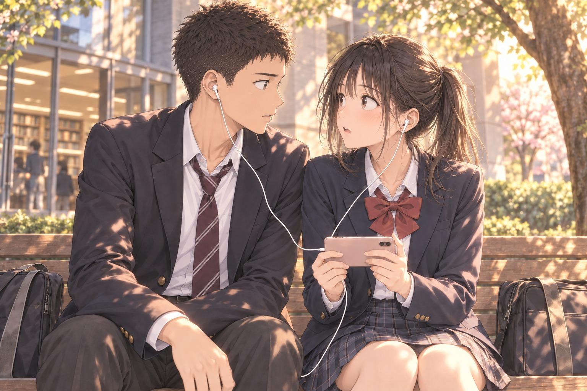

# ［P04-03］片耳ずつの一曲

午前中に使った席には、別の人が座っていた。

並んで空いている席もない。由美子が通路の先にある一席を指すと、勇は二列向こうの空席を見つけてうなずいた。

二人は声を掛けず、それぞれの席で問題集を開いた。勇の席からは、由美子がときどき参考書へ手を伸ばすのが見えた。

昼食の話が頭に戻りかけたが、勇は途中だった計算式へ目を落とした。

一時間ほどして、ようやく最後の問題を解き終えた。

顔を上げると、由美子がノートを閉じたところだった。先に荷物をまとめ、学習室の出口で振り返る。勇が解き終えたページを軽く掲げると、由美子も問題集を掲げて外へ出た。

勇が荷物を片づけて出ると、由美子はまだ本棚の前にいた。

発声についての本と、呼吸についての本を一冊ずつ抱えていた。

「宿題、終わった」

「お疲れ」

由美子が二冊の表紙を見せた。

「次は、こっち。また決められない」

「迷ったら両方借りれば？」

「あ、それだ！　勇くん天才じゃん」

「いや普通誰でも思いつくでしょ」

由美子は嬉しそうに二冊を抱えて貸出カウンターへ向かった。勇は自分が使った本を戻してから、玄関へ行った。

由美子は借りた二冊を鞄へねじ込もうとしていた。問題集に引っかかり、ファスナーが悲鳴を上げている。見かねた勇が手伝おうとすると、由美子はいったん問題集と譜面を取り出して、本から順に詰め直した。

取り出した譜面には、三人で歌っている曲の題名が手書きされていた。勇はその一番上の一枚に目を留めた。

「それ、さっき昼に言ってたやつ？」

由美子が譜面へ目を落とす。

「うん。最初の挨拶一分のやつじゃないよ」

「聴きたい」

「えっ」

由美子は目を丸くした。

「……さっきの私の話、聞いてた？」

「うん。河合さんがどんなふうに歌ってるのか、聴いてみたい」

勇が、いつもの軽口ではなく、まっすぐな瞳でこちらを見ていた。

身近な知り合いに見せるのは、間違いなく勇が初めてだった。
ものすごく恥ずかしい。耳の奥までじわっと熱くなる。
だけど――それ以上に、勇に自分のことを知ってもらいたいという気持ちが、恥ずかしさに勝っていた。

「……一本だけね」

由美子は譜面をバッグへしまい、代わりにスマートフォンを取り出した。

「変な動画ないか勝手に漁っちゃダメだよ」

「挨拶が一分あるやつ？」

「消したってば！　あれ見られたら恥ずかしすぎて絶交だからね」

由美子がぷくっと頬を膨らませると、勇は笑って降参のポーズを取った。

「ほら、あそこ座ろ」

外のベンチが空いていた。

由美子が端へ座り、勇も少し間を空けて座る。二人の間には、鞄が一つ置けるくらいの幅があった。

動画の一覧をスクロールしながら、由美子が選ぶ。

「よし、これにしよ。……はい、こっち」

由美子が白のイヤホンの片方を差し出した。勇が受け取って右耳につけると、短いコードがピーンと張った。由美子は慌ててスマートフォンを二人の真ん中へ寄せる。

「……知り合いに聴かせるの、勇くんが初めてなんだからね」

「え、そうなの？」

「そうだよ。だから……聴き終わったら、ちゃんと感想ちょうだいね」

「うん」

「悪いところ言う前に、いいところ三個！」

勇が苦笑いした。

「じゃ、いきます！」

そう宣言してから、再生ボタンを押すまでに小さな深呼吸があった。

画面の三人が息を吸う。

声が重なった。

昼の愉快なお辞儀の話を思い出しかけたが、イヤホンから流れ込んできた澄んだハーモニーに、勇は一瞬で引き込まれた。

由美子は、静かに聴かれるのが恥ずかしくなって、声をかけた。

「……私の声、分かる？」

横からこっそり聞かれ、勇は画面の真ん中で歌う由美子を指した。

「今、メイン歌ってる？」

「うん」

「分かるよ、ちょっと静かに」

「はい、黙ります！」

由美子が口にチャックをする仕草をして、二人でくすくす笑い合った。今度こそ二人とも画面に集中する。

日差しが傾き、木の葉の影が画面に映り込んで三人の顔が見えにくくなった。由美子がスマートフォンの角度を変える。勇も、画面を覗き込もうと自然に身を寄せた。

「これなら――」

見える？　と顔を向けた瞬間だった。

同時に、勇も画面から顔を上げた。

距離にして、ほんの十数センチ。

思っていたよりもずっと近くに勇の顔があった。由美子の手が止まる。

勇の視線も、画面ではなく由美子へ向いていた。

「……」

「……」

勇の視線がふっと由美子の目元に止まり、お互いに見つめ合ったまま、言葉が喉の奥でつかえる。

ほんの一、二秒、どちらも動かなかった。

由美子が先に、そっと体を引いた。

「……っ」

「……あ、ごめん。画面見ようとして、近づきすぎた」

勇も視線を落とし、耳にかかったイヤホンのコードを指先で直した。

「う、ううん。私こそ、急に顔向けちゃったから……」

由美子はスマートフォンを二人の真ん中へ置き直した。

「……続き、聴こっか」

「うん」

二人はぎこちなく息を整え、再び画面へと視線を落とした。

歌は後半に入っていた。三人の声が重なる中でも、耳が自然と由美子の声を探し当てていた。

画面の由美子が、隣の二人へ視線を送る。二人の高い声と低いハミングの上に、由美子の伸びやかな主旋律が重なる。歌い出す前の緊張がすっと解け、フレーズの終わりでふっと柔らかい表情がこぼれる。

勇は、その表情を見つめていた。

歌っているときの顔は、教室で見せる笑顔とも、さっき食堂で笑っていた顔とも違っていた。まっすぐで、どこか大人びていて、目が離せない。

隣の由美子が、小さく息を吸った。画面の中の由美子と、全く同じタイミングだった。

勇がそっと横目で見ると、由美子は画面の二人と呼吸を合わせるように、小さく顎を引いていた。

最後に伸ばした三人の和音が、春の空気の中にふわりと溶けて消える。

動画の最後、真希の「今のめっちゃよくない！？」という声と三人の笑い声が入って、画面が暗転した。

勇がイヤホンを外し、指に引っかけたまま言った。

「サビで3人違う音になるところ、あそこ、すごく好き」

「ほんと！？」

由美子がパッと顔を輝かせた。

「うん。河合さん、二人と顔を合わせながら、歌ってたね。呼吸を合わせてるの？」

「そう、そうなの」
「なかなか思うようにいかなくて、何十回録り直したか分かんないもん」

由美子は止まった画面を愛おしそうに指さして笑った。画面の中と同じ、曇りのない笑顔だった。

「河合さんの歌声、もう一回聴きたいな」

「えー、隣で二回連続は恥ずかしすぎて耐えられない！　動画あとで送るから、家で一人で聴いて」

「じゃあ送って」

「うん、送る」

二人はスマートフォンを構え、そこでピタリと動きを止めた。

「……あ」

「どうした？」

「私たち、連絡先知らないじゃん」

「……ほんとだ」

顔を見合わせた。
画面を切り替え、連絡先を交換した。
由美子の画面に《神谷勇》の文字が追加される。そのトーク画面を開き、さっきの動画を送信した。

「届いた？」

「うん、来た。ありがと」

勇が画面を見せて微笑む。

「……じゃあ、そろそろ帰ろっか」

「うん」

二人はベンチから立ち上がり、駅への道を並んで歩いた。

夕方の風が少し冷たくなってきた交差点で、由美子が足を止めた。

「じゃあ、私こっちだから」

「うん。また月曜、学校で」

「月曜ね。宿題忘れないようにね！」

「河合さんこそ」

勇が笑って手を挙げると、由美子も小さく手を振り返して、改札へと向かった。

角を曲がる由美子の背中を見送りながら、勇はポケットの中のスマートフォンに触れた。

自分でレールを降りて、三人で新しい道を選んだと言っていた由美子の言葉と、さっきイヤホンの向こうでまっすぐに響いていた歌声が、まだ耳の奥に残っていた。

勇は前を向いて歩き出した。

夕暮れの街を抜ける風の中で、足取りが自然と少し速くなっていた。
