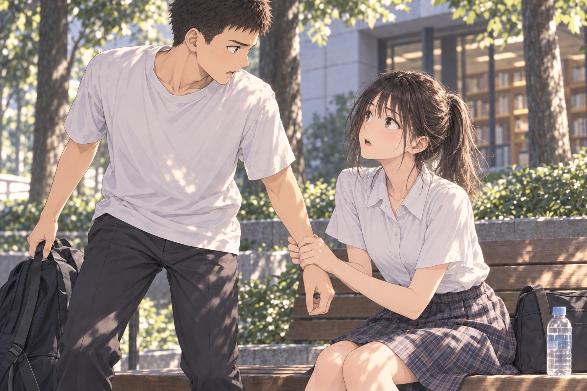

# ［P10-02］先に動いた手

「……試合、ありがとう。見てくれて」

勇が言った。

由美子は顔を上げる。

「うん」

短く返して、待った。

勇はペットボトルのラベルを親指でなぞっていた。

「みんな、すごかったって言ってくれるんだよね。学校でも。家でも」

少しだけ笑う。

「うれしいんだけど。まだ、うまく返せなくて」

由美子は水筒を膝へ置いた。

「私も、何送ったらいいか分かんなかった。何回か書いて、消して」

勇が顔を向けると、由美子は小さく首を振った。

「だから、返事のことは気にしないで。読んでくれたの、分かったから」

勇はコートのない広場を見た。子どもが一人、父親のほうへ走っていく。

「最後、入ると思ったんだ。パス来たときから。打ったあとも、そんなに悪くなくて」

右手が少し上がる。

指先が開き、また閉じた。

「外れても、まだ、次があるつもりだった。いつもは戻って守るとか、もう一本打つとか。……何もしなくてよくなったのが、一番変だった」

由美子は、ブザーのあとも両手を上げていた勇を思い出した。

その手が、いま目の前にあった。

「来年こそ、って言われると、そうだなって思う。柳田は二年だし、またやれるし」

勇はそこで言葉を切った。

「でも、篠原さんたちはいないんだよね。来年」

ペットボトルを持つ手に、少し力が入った。

「秋からずっと一緒に練習してたのに、公式戦で一緒にできたの、四月からで。まだ三か月くらいしか経ってなくて」

風が吹いた。

由美子の髪が頬へかかったが、彼女はすぐには払わなかった。

三か月、と口の中だけで繰り返した。

昼食のときは、入学前から先輩たちと練習できたことを、よかったねと思って聞いていた。学校に入る前から居場所があって、あんなに楽しそうに話せる人たちがいて。

その半年より、一緒に試合に出た時間のほうが短かったのだ。

由美子は水筒を持ち直した。前にも先輩の話はたくさん聞いた。だから今も少しは分かるつもりでいたのに、目の前で途切れた声には、すぐ返せる言葉がなかった。

続きを聞いていたい。今、顔を見て話してくれているうちは、何も言えなくても、ここにいたかった。

勇は、自分が随分しゃべっていることに気づいた。

「……ごめん。こんな湿っぽい話。せっかくの休みなのに」

勇はいつものように笑おうとした。

けれど、うまく口角が上がらなかった。

由美子は、その無理に笑おうとする横顔を見た。

そんな顔、しなくていいのに。自分に気を遣って、これ以上話すのを諦めようとしている。

「……そろそろ、戻ろっか」

勇がペットボトルを脇へ置き、立ち上がろうと鞄の持ち手に手を伸ばす。

その手を、由美子がぎゅっと掴んだ。

「待って」

勇の腕が止まった。

驚いて見開かれた視線が、自分の右手に落ちる。由美子の両手が、勇の手をしっかりと握っていた。

顔を上げると、由美子がまっすぐ勇を見つめていた。

「まだ、聞いてるよ。……何て言えばいいか分かんなかっただけで、話すのやめないで」

言いたい言葉を探す間も、その手は絶対に離さないとばかりに握られていた。

勇は浮かせかけた腰を、ゆっくりとベンチへ戻した。

「私も、先輩たちと喜んでるところ、もう一回見たかった。だから……『来年がある』なんて、薄っぺらいこと言えなかったの」

勇は、脇へ置いたボトルを見つめた。

「……うん」

由美子は小さく息を吸い込んだ。

「……私ね、あの試合見て、もっと歌いたいって思ったんだよ」

勇がハッとして由美子を見る。

「点がどれだけ離れても、勇くん、何度も走って、何本も打ってたじゃん。……私が見てたの、最後の一本だけじゃないよ。勇くんがずっと戦ってた姿全部、ちゃんと見てた」

由美子はまっすぐに勇の目を見た。

「メッセージでも送ったけど……今日、ちゃんと隣で、顔を見て言いたかったの」

勇は言葉を探した。

外した一本ばかりを、ここまで何度も思い出していた。けれど由美子は、その前のことを見ていた。自分が次のパスをもらいに走っていたことまで。

「……ありがとう」

少しかすれた声で言うと、由美子が小さく息をついて微笑んだ。

勇もつられて口元を緩めかけて――ふと、自分の手元を見た。

まだ、由美子の両手が重なったままだった。

勇の視線につられて、由美子も目を落とした。

指先が、わずかに緩む。

引かれかけたその手を、勇の右手が追った。

離れようとした由美子の指を、下から包み込むようにして、しっかりと握り返す。

由美子が顔を上げた。

目が合う。

由美子の手のひらは温かく、指先に微かな力がこもっていた。引こうとする動きは止まったが、驚いたように瞬きをひとつした。

逃げ出したいような気配はない。自分から掴んだ手だったことを思い出したのか、由美子は少し眉を寄せ、困ったように視線を勇の手元へ落とした。

勇も手を離せなかった。

あの試合の全部を見ていてくれたこと。こうして隣で、まっすぐに言葉を届けてくれたこと。その全部が嬉しくて、手放したくなかった。それだけではなく、触れている指先の柔らかさや、重なる体温から、急に意識が離せなくなっていた。

風が吹き抜け、木々の葉がさらさらと音を立てる。

ほんの数秒の間、二人の間に言葉はなかった。

勇が指の力を少し抜くと、由美子の手もゆっくりとほどけた。

由美子は膝の上で手を重ね、水筒のふたの端を親指でなぞった。

「……戻っちゃうと思って、つい」

「うん。……嬉しかった」

勇が答えると、由美子は小さく口角を上げた。

「そっちは驚いただけじゃない？」

「驚いたけど。……それだけじゃないよ」

由美子が横目で勇を見た。勇が頭の後ろに手をやると、由美子はふっと息を漏らし、抱えた水筒を見つめた。

ベンチの横を、自転車を押した人がゆっくりと通り過ぎていく。車輪のカタカタという音が遠ざかるまで、二人は並んで木漏れ日を見つめていた。

勇は膝の上の右手を、軽く握り直した。

手のひらに残る熱のせいで、さっきまで胸に刺さっていた悔しさの角が、少し丸くなった気がした。鞄に伸ばしかけた手は、もう戻っていた。

「……今日、来てよかった」

勇が言うと、由美子が顔を向けた。

勇は視線を逸らさなかった。

「会えてよかったよ」

由美子は一瞬、目を丸くした。

それから誤魔化すように、両手で水筒を持ち上げた。

「……うん。私も」

小さな声で返して、そのまま水筒に口をつけようとする。

「ふた」

勇が言うと、由美子の動きが止まった。

閉まったままだった。

「……分かってる。今、開けるところ」

由美子は前を向いたまま、小さく唇を尖らせてふたを回した。

勇が声を出して笑うと、由美子もつられて吹き出し、肘で軽く勇の腕を小突いた。

冷たいお茶を一口飲んで、二人は木陰の風に吹かれた。

ベンチの上、二人の間に置かれた手の距離が、さっきよりもほんの少しだけ縮まっていた。
