# ［VISUAL］キャラクターデザイン

人物の性格・能力・来歴は[人物設定](characters.md)を参照する。ここでは絵に表す判断を扱う。

## 承認済み基準画

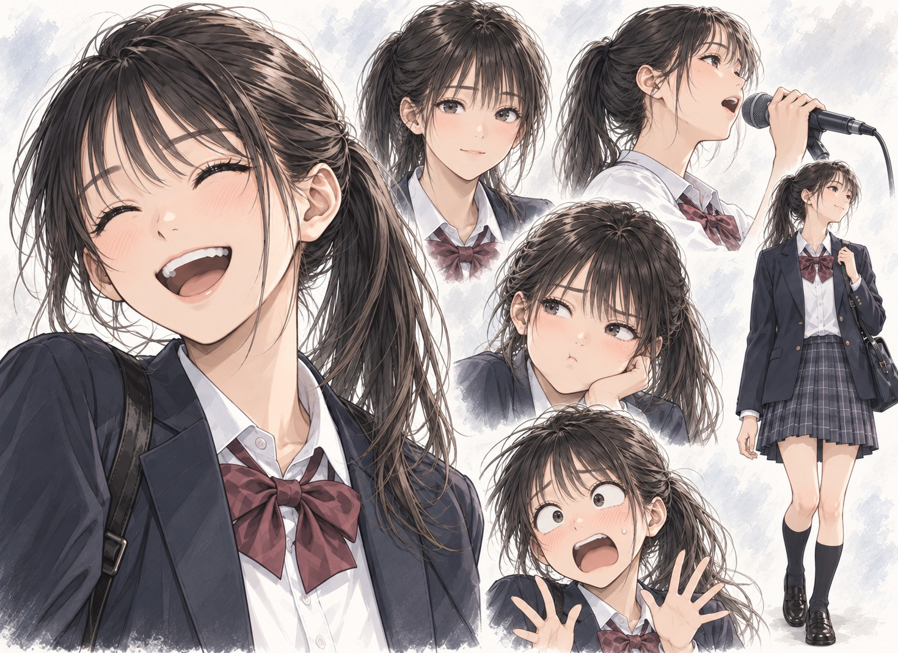

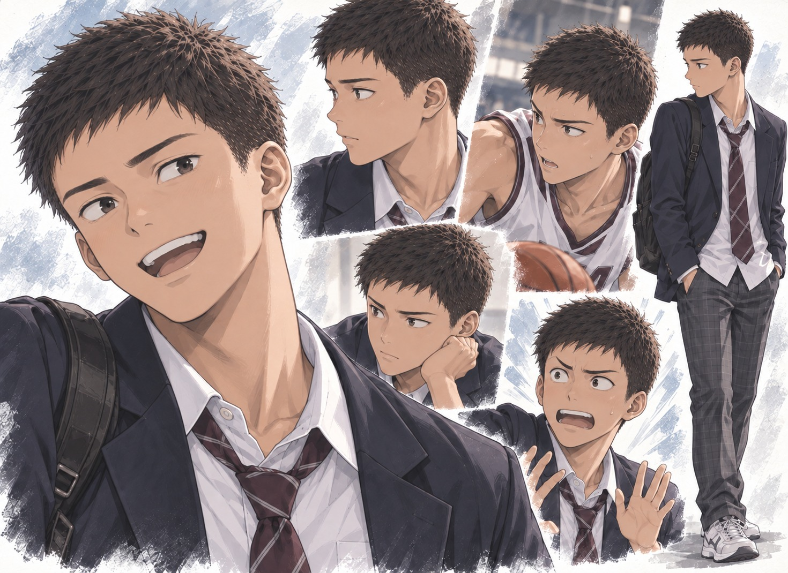

### 親友・アカペラ部

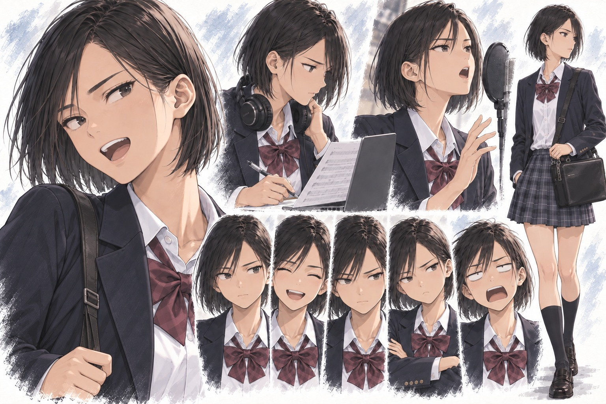

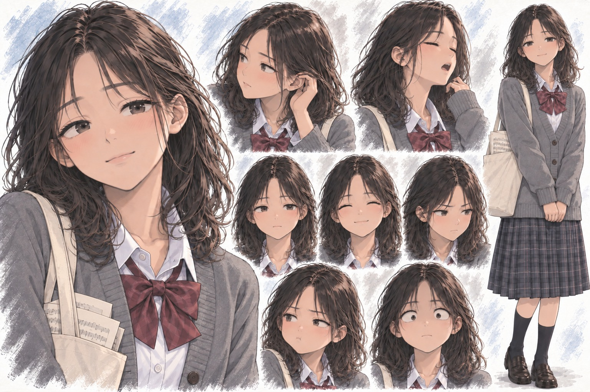

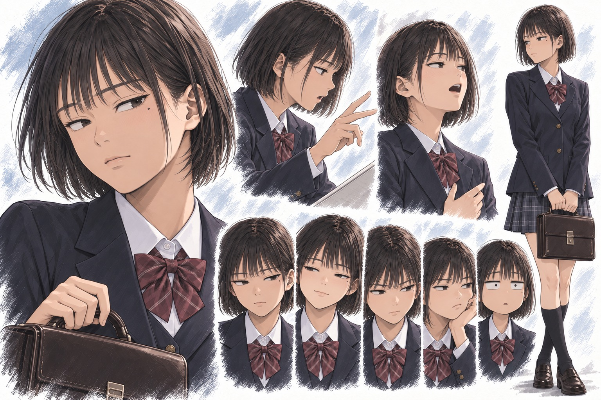

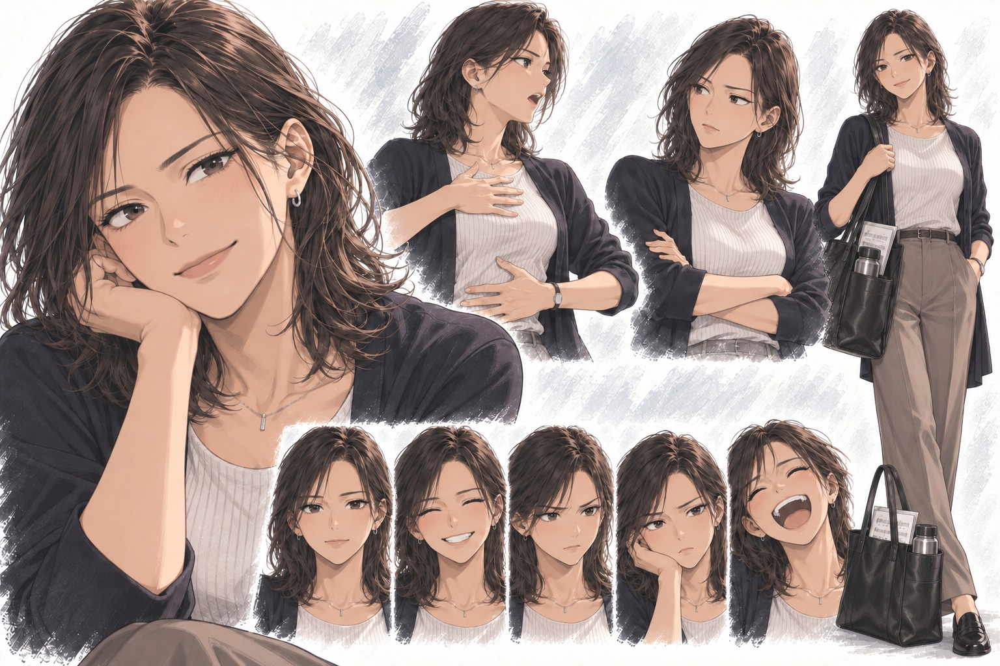

### バスケットボール部

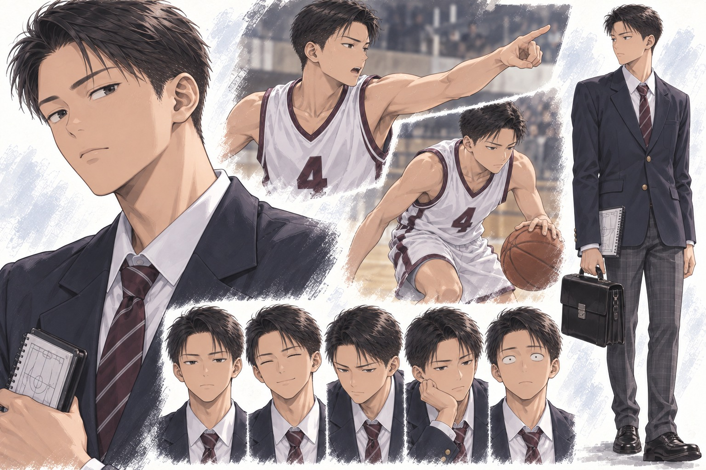

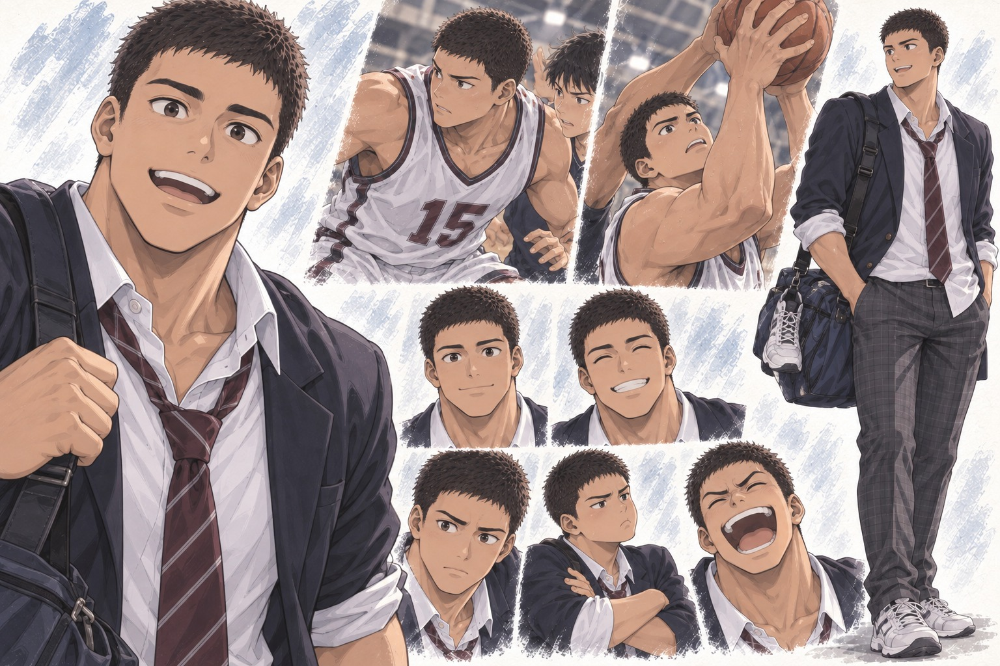

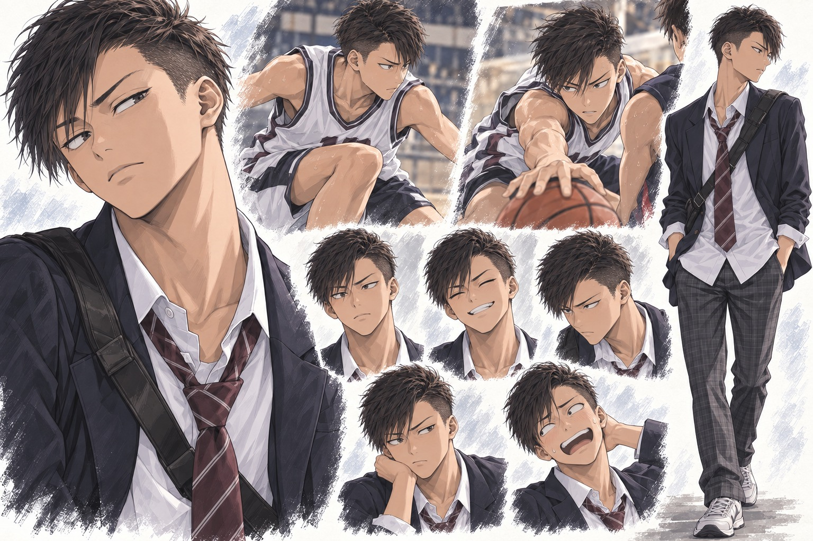

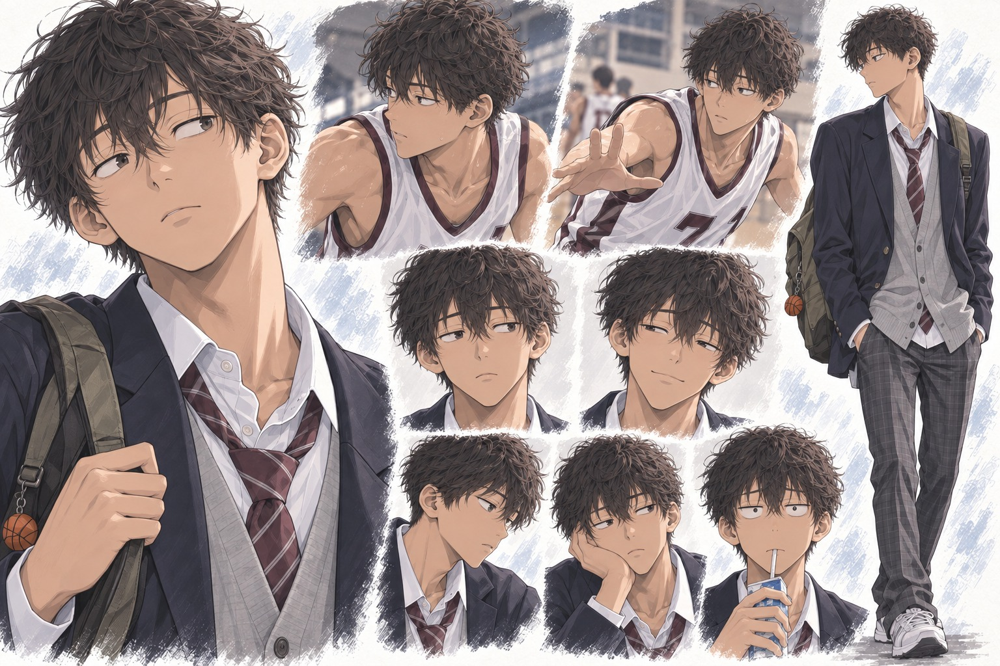

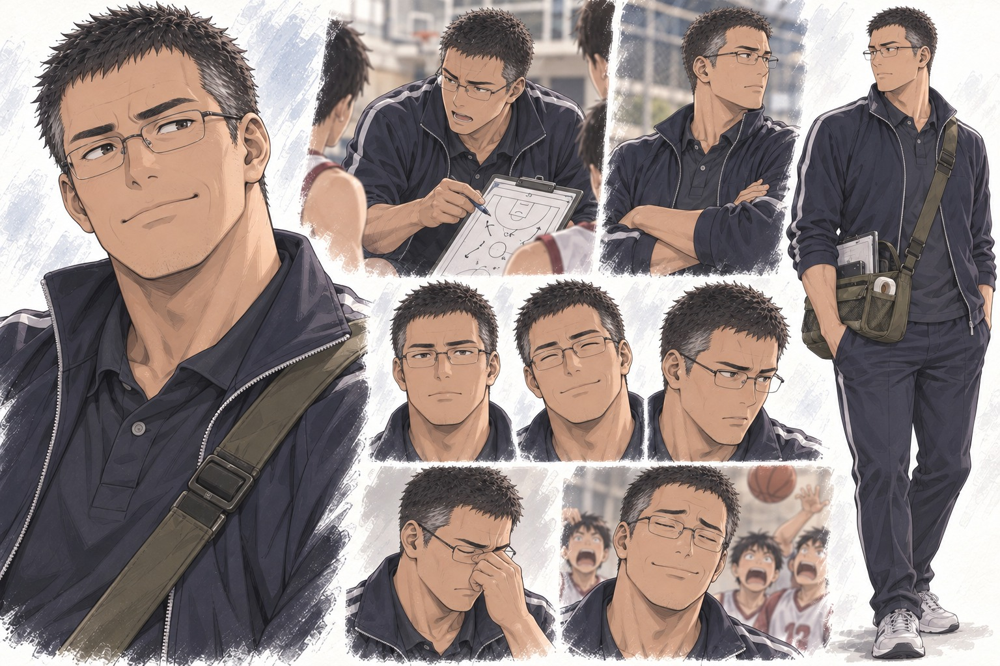

勇・由美子と上記主要人物の顔立ち、目つき、髪型、体格、日常・競技／歌唱時・すねた表情・ギャグ寄りの崩れ顔は、各専用基準画を優先する。場面ごとの服装と関係段階は本文と[ストーリー](story.md)を優先する。下表に明記した着方・鞄・持ち方は人物識別の要素として維持し、画像に見えるだけの色・装飾・未記載の小物を文章設定へ昇格させない。

## 主要人物の作画上の個性

| 人物 | 目つき・顔 | 髪・体つき | 制服・鞄・立ち姿 |
| --- | --- | --- | --- |
| 佐伯真希 | 小さめで切れ上がった目、低く直線的な眉、判断の速い横目 | 横分けの顎丈ボブ、細身で直線的 | 襟・リボン・袖を整え、薄いPC用角形バッグを身体の近くで持つ |
| 高瀬静香 | 目尻の下がった横長の目、柔らかな頬、ゆっくり相手を見る | 鎖骨丈の緩いウェーブ、柔らかく安定した体つき | カーディガンと少し長めのスカート、楽譜入りの布トートを両手または肩で持つ |
| 白石千尋 | 目尻の上がった大きな目、太めの眉、正面から人を見る | 耳の出る赤みの短髪、背が高く活動的 | 袖を肘まで整えてまくり、上着は開くか肩へ掛け、部活用ダッフルを担ぐ |
| 水野麻里 | 横に細い半眼、低い上まぶた、片目下の小さなほくろ | 前髪のある切り揃えボブ、小柄で重心が安定 | 第一ボタンまで整え上着も留め、小型の角形手提げ鞄を身体の前で持つ |
| 柚木沙耶 | 成人らしい深いアーモンド形の目、目尻と目元にわずかな年齢感 | 肩丈の緩いウェーブ、引き締まった成人女性の体つき | ニットとワイドパンツなどの仕事着、楽譜と水筒の入る革トート |
| 篠原直樹 | 細い一重、水平の目尻、小さな瞳で静かに全体を見る | 端正な横分け短髪、細身で姿勢が崩れない | 上着とネクタイを整え、角形の手提げ通学鞄と戦術ノートを持つ |
| 久世大地 | 丸く深い目、太い弧状の眉、開放的な視線 | ごく短い坊主、首・肩・手が大きい重量級 | 大きな肩に合わせ上着は開き、ネクタイと袖を緩め、大型バスケダッフルを担ぐ |
| 朝倉律 | 瞳の小さい切れ上がった狐目、左右差のある眉、疑うような横目 | 刈り上げと長めの流した前髪、細く筋張った体つき | ネクタイと第一ボタンを緩め、左右で袖の折り方も揃えず、小型スリングを背に密着させる |
| 小野寺航 | 離れた眠たげな垂れ目、薄い眉、視線だけ遅れて対象を捉える | 不揃いな柔らかい癖毛、長身で手足が長い | やや大きい上着とカーディガン、布リュックを片方の肩だけで持つ |
| 坂井修司 | 角形眼鏡越しの半眼、小さな瞳、太く直線的な眉 | 生え際の下がった短髪、厚みのある元競技者体型 | 体育教師のトラックジャケット、端末・テープ・ボードの入るメッセンジャーを斜め掛けする |

制服の色、校章、ボタンや鞄のブランドなどは未確定のままにする。人物識別では、服装そのものより、整える・緩める・担ぐ・身体へ寄せるといった扱い方を優先する。

## 勇の外見

耳と額が見え、前髪が目にかからない、スポーツ刈り寄りの短髪の男子バスケ選手。

整った顔立ちだが、気取った王子様ではない。長いまつげやアイライン風の目元、過度な赤面など、乙女的・美少年ゲーム的な造形には寄せない。

- 健康的
- 動きやすい体つき
- 大柄ではない
- 制服は普通に着る
- 困ると頭をかく
- 笑うと年相応
- バスケ中は普段より表情が鋭くなる

すましたイケメンとして固定せず、練習後の疲れ、照れ、抜けた表情も見せる。

## 由美子の外見

明るく、親しみやすい美少女。

近寄りがたいタイプではない。

### 特徴

- 笑うと目がにこっと細くなる
- 表情が豊か
- 健康的
- 髪型は自然
- 派手すぎない
- 制服も普通に着る
- 話すとき相手の顔を見る

普段の明るさと、歌うときの集中した表情にはギャップがある。

## 制作上のイメージ

- 勇の顔立ちの参考は佐藤健さん風という方向性。ただし最新の短髪スポーツマンの指定を優先し、長めの髪やすました表情だけの人物に寄せない。
- 由美子の参考はLittle Glee Monsterの結海さん風。採用する造形は上記の「由美子の外見」を基準とする。
- いずれも制作時のイメージであり、実在人物を作中に登場させる設定ではない。
- 承認済みのキャラクターアートを使う場合は実物を確認して外見の連続性を保つ。画像に見えるだけの髪色・衣装・小物を、承認なく文章設定へ昇格させない。

## 表情と二人の距離

| 人物・場面 | 絵で見せるもの |
| --- | --- |
| 勇の日常 | 年相応の笑い、頭をかく仕草、疲れ、気の抜けた顔、隠しきれない照れ |
| 勇の競技中 | 短髪と動きやすい体つき、集中した視線、シュート前後の姿勢 |
| 由美子の日常 | 相手の顔を見る、よく笑う、軽い呆れ、照れを笑ってごまかす表情 |
| 由美子の歌唱中 | 歌詞で変わる表情、仲間へ向ける視線、普段の明るさと集中の差 |
| 嫉妬・切なさ | 視線が残る、返事までの間、口元や手元の小さな変化。怒り顔や赤面だけに頼らない |
| 勇を慰める由美子 | すぐに正解を返せずに聞く顔、話を終わらせたくない動作 |

初対面、図書館、準決勝の応援、リードへの挑戦、巻末の図書館などの絵は、該当場面の場所・服装・関係段階を確認して描く。アートのバリエーションを作っただけでは、その出来事を小説の確定場面にしない。

本作の場面アートには画像中の文字を入れない。手や肩の接触を演出で増やさず、物語上の接触時期は[ストーリー](story.md)に従う。バスケ・アカペラの図解を添える場合も、その場で実際に行っている役割や動作を示す。

## 挿絵生成・更新の必須手順

新規挿絵の作成および既存挿絵の更新では、着手前にこの文書と該当本文を読み、登場する勇・由美子および主要人物の専用基準画をすべて画像入力として直接与える。複数人が登場する絵では該当者全員の基準画を与え、文章による特徴指定だけで代用しない。

構図、場所、服装、小物、人物間の距離、接触の有無、感情段階は該当本文を優先する。基準画は人物同一性の固定に使い、基準画の制服やポーズを場面へ持ち込まない。

集団場面では、脇役一人ひとりの顔の輪郭・目鼻・髪型・身長・体格・姿勢・役割に応じた表情を意図的に描き分ける。同じ顔や同じ髪型の反復を避け、勇・由美子の基準画を脇役へ流用しない。

保存前に次を目視確認し、一つでも外れた場合は挿絵として採用せず再生成する。

- 勇：耳と額が見える短髪、前髪が目にかからない、長いまつげ・アイライン風の目元ではない
- 由美子：専用基準画と同じ顔立ち、自然なポニーテールと後れ毛、場面に応じた豊かな表情
- 共通：体格・年齢感・画風が基準画と連続し、別人化していない
- 主要人物：専用基準画どおりに目の形・眉・輪郭・髪・体格・制服の扱い・鞄の持ち方を識別できる
- 集団：部員ごとに顔・髪型・身長・体格・姿勢・役割表情を識別でき、クローン化していない
- 場面：本文にない接触、服装、小物、人物、文字を足していない
- 出力：画像内に文字、ラベル、透かし、枠線を入れていない

## 未確定の造形

制服の色・細部、学校や駅の所在地、専用基準画のない脇役の髪型・顔立ち、未提示の小物は、既存資料に根拠がない限り未確定。新しい作画案を確定設定として混ぜない。体格の数値は[人物プロフィール](characters.md)を参照し、別表で重複管理しない。
